### Title: Bad Weather Minder
#### Author: Zhilang Rong
#### Created: 11/09/2019

## Description
This python script is to be used with the Windows Task Scheduler to alert you if it is currently snowing or raining. The alert will come in the form of a Toast Notification. User will be able to schedule this script to run in any faction using the Task Scheduler, but in this tutorial, I am setting the script to run upon log in.

## Tutorial
### To install
```bash
git clone https://github.com/zrong5/BadWeatherMinder.git
python3 -m pip install -r requirements.txt
```

### To Schedul a Windows Task
First, search for Task Scheduler in your search bar.  

&emsp;&emsp;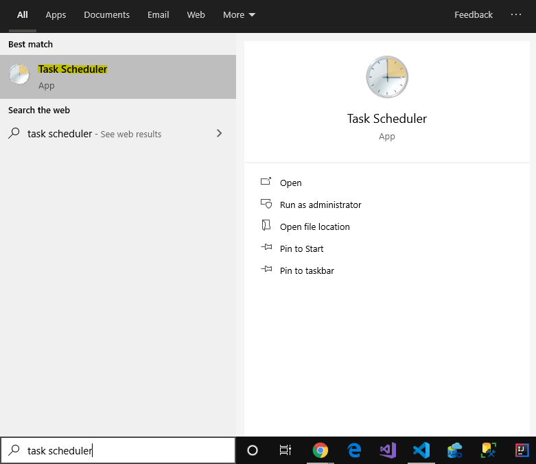 

Click "Create task" in the Actions panel.  

&emsp;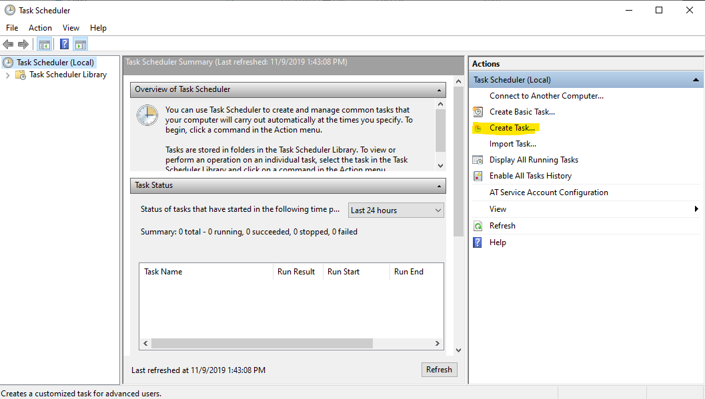  

Provide a name and configuration.

&emsp;&emsp;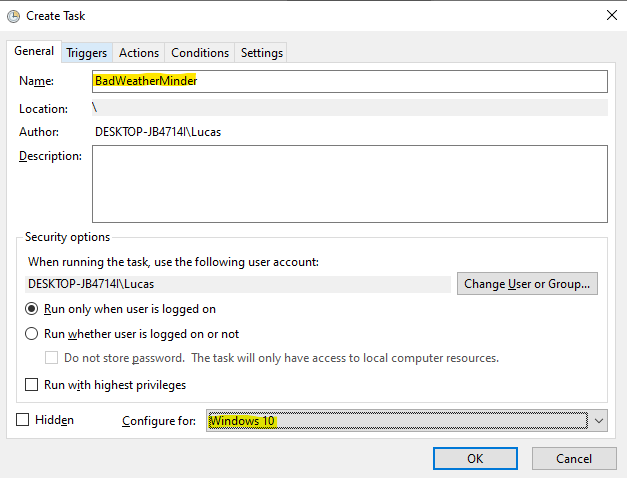  

In the "Action" tab, click "New".

&emsp;&emsp;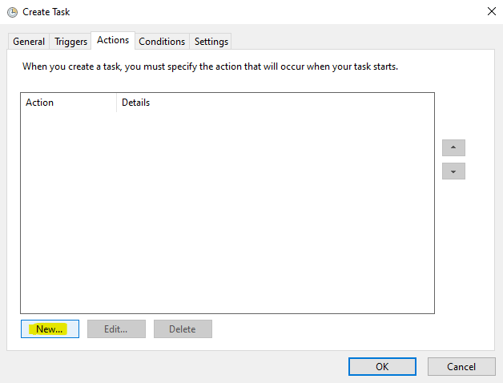  

Find where python3.exe is located. To do this, in cmd, use where comdlet and copy the path for next step.  

&emsp;&emsp;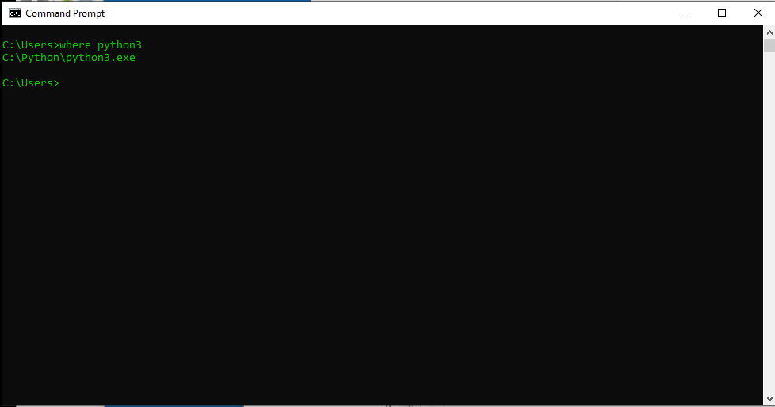  

Paste location of python3.exe into "Program/script".  

&emsp;&emsp;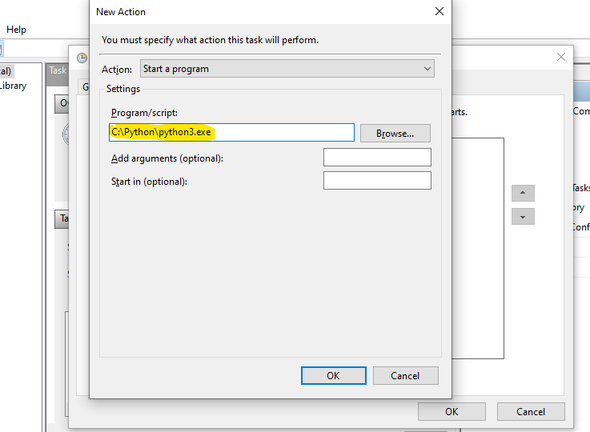  

Enter the name of this script "Minder.py" as an argument.  

&emsp;&emsp;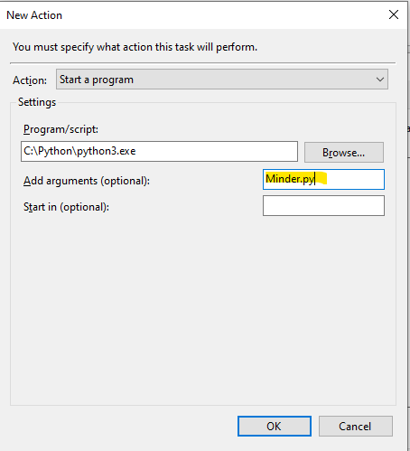  

Enter the directory in which "Minder.py" is located in.  

&emsp;&emsp;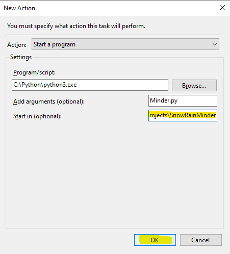  

In the "Trigger" tab, click "New".  

&emsp;&emsp;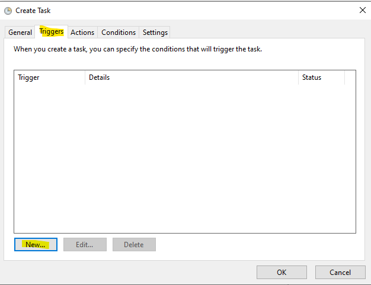  

Here you can set the frequency and time this script will be run. For me, I have chosen "1 minute after log on".  

&emsp;&emsp;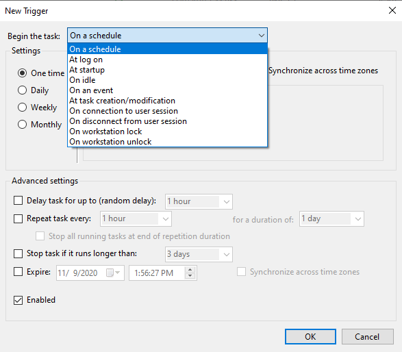  
&emsp;&emsp;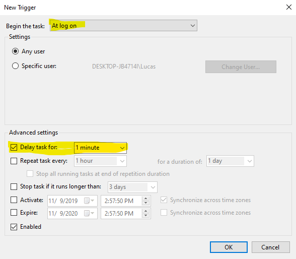  

Go back to "General" tab and click "OK".  

&emsp;&emsp;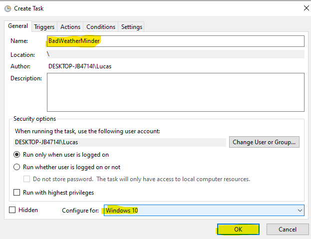  

Congrats! Now you have scheduled an automated task that alert you if it is raining or snowing outside!


